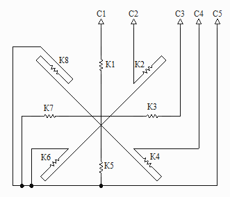
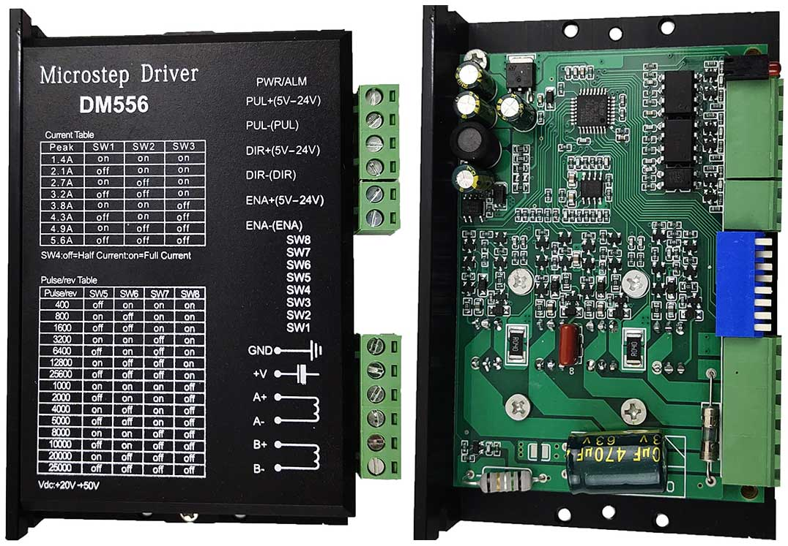

# Sh2.65-50-01
Драйвер для униполярного шагового двигателя Ш-2,65/50-01.

Схема двигателя:

Драйвер сделан на основе безымянного китайского драйвера DM556 с чипом STM8S903K3T6C.

Нижний ряд IRFZ44N убран, вместо них запаяны диоды.

Прошивка собирается с помощью [PlatformIO](https://platformio.org/).

Защита по току не реализована. Только полный шаг, 136 импульсов на оборот. Переключателями задаётся максимальный ток путём изменения скважности ШИМ.
